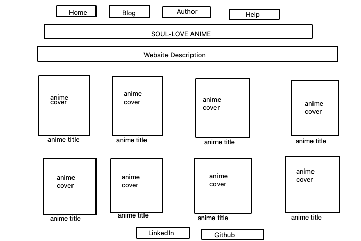
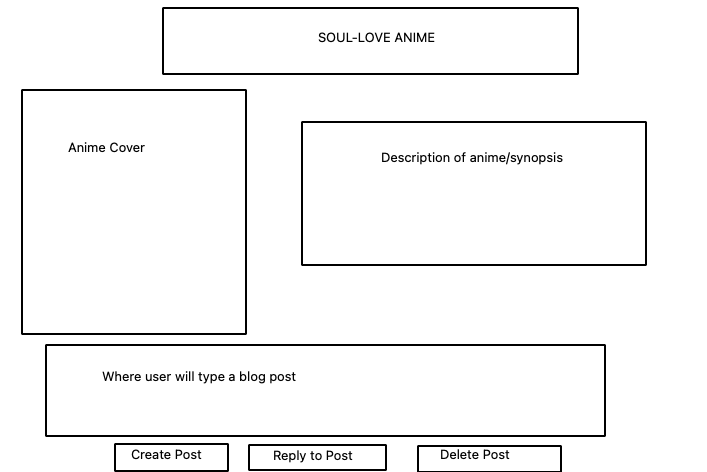

# soul-love-anime-part2

1. User Story 
- The user will have the ability to select any anime on the list of animes displayed on the home page upon clicking the title located below the anime cover. 

- The user will then be directed to a blog page where they can create a blog. 

- User can also navigate to different pages by clicking any of the nav bars located above the title of the browser. 

2. Stretch Goals

- The user will have the ability to select any anime  on the animes displayed on the home page upon click. 

- The user will then be directed to the blog page where they can create a blog post based on the anime they have selected. 

- users can delete post if they choose to.

- other users can reply/comment on blog post. 

- Users can communicate with others by either replying to or commenting on blog post. 